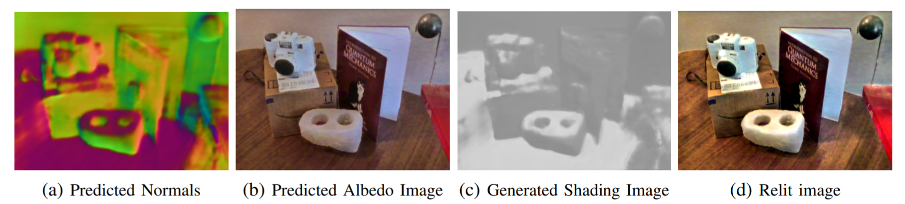

# Deep Scene Relighting for Video

The goal of this project is to take a source video with unknown lighting conditions and apply new lighing to the video under any target illumination. The project report can be found [here](https://www.luisjguzman.com/media/Csci5563/Project_Report__Deep_Scene_Relighting_For_Video.pdf) and the project video can be viewed [here](https://youtu.be/tt2wKUsNhy4).

The code can be run using `video_scripts/video.py` using the following command line arguments.

| Argument | Default Value | Description |
| --- | --- | --- |
| `--video_name` | `face_video.mp4` | Name of the video to process |
| `--image` | `None` | Name of a single image to process |
| `--lighting` | `None` | Name of the target lighting to use |
| `--intrinseg_weights_loc` | `../intrinsic_image_decomposition/intrinseg/experiment/ synthetic_trained/checkpoints/final.checkpoint` | Model location for the intrinsic image decomposition |
| `--normal_weights_loc` | `./normal_weights/ExpNYUD_three.ckpt` | Model location for the normal estimation network |
| `--cmap_file_loc` | `./normal_weights/cmap_nyud.npy` | Color map location |
| `--output_file` | `relit_video.mp4` | Output filename |
| `--visualize` | `False` | Set this flag to visualize each frame as the video processes |
| `--benchmark` | `False` | Set this flag to run an entire dataset of images |
| `--gt_normals` | `False` | Set this flag to use ground truth normals from a microsoft Kinect sensor |
| `--gt_lighting` | `False` | Set this flag to the use groud truth target lighting for error calculations |
| `--kinect` | `False` | Set this flag to use RGB images from a Microsoft Kinect sensor. They will be cropped to the coverage area of the depth sensor.
